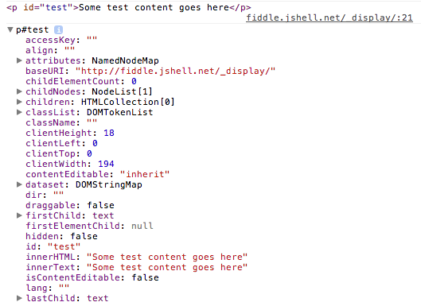

*This article is meant as an introduction to some of the features of the JavaScript console. It is not all encompassing, but I will try to cover all the features I find myself using and others that I could not live without. All the features mentioned will be tailored to the Chrome Dev Tools, but I will try to mention any differences with other modern browsers.*

## Accessing the dev tools

If you have never used the developer tools before, you may have problems finding them. The easiest and simplest way to access the developer tools is by using the keyboard shortcuts. On Mac, this is `Command + Option + I`. On Windows, it'll be `F12`. In Safari, you'll have to enable the developer tools under preferences first.

You can also inspect an element directly by right clicking and choosing `Inspect Element`, and you can always access the dev tools from the menu shortcuts.

## Console Functions

The console global is an object that provides some useful shortcuts for debugging JavaScript. Arguably the most used function is `console.log`, but did you know the console also provides `info`, `warn`, `debug` and `error` functions. They operate in the same way as the `log` function, but the visual output will be altered and `error` output an accompanying stack trace.

All these functions accepts an unlimited number of parameters, and will be formatted for output in the console in different ways - depending on the object types there are. For example, DOM nodes will output as a representation of the node from the elements tab while array-like objects will appear as an array.

However, this added formatting convenience can sometimes be a pain. This is especially relevant when you want to see the underlying structure of a DOM node or an object. You may not even know it, but you have probably needed `console.dir` at some point because it does exactly this.

## Manipulating Nodes from the Elements Tab

We've all been there - playing with a DOM node in the elements tab, but now we need to use JavaScript on it. We could do a regular DOM traversal to find it, but then we have to remember the ID or tag name, maybe even some obscure combination involving classes. If you switch to the Console tab on the Developer Tools, you can always grab the latest node you had selected using the `$0` variable shortcut. In Chrome, this can even be expanded upon up to `$4` - that's the latest five elements you had selected.

`$0` - `$4` are direct references to the DOM nodes, so you can start manipulating it directly by grabbing the inner text (`$0.innerText`) or passing it to jQuery for manipulation (`$($0)`). While on the subject, did you know Chrome also provides an alias to `document.querySelectorAll` under `$$` and `document.querySelector` under `$` (if jQuery hasn't overwritten it of course).

## Other Useful Console Functions

Don't despair yet, Chrome still has a wealth of functions at your debugging disposal. For your timing purposes, there is `console.time` and `console.timeEnd`. Each accept a single string as the name of the timer to stop and start. Even cooler is `console.assert`, which accepts two parameters - the check and a string - and logs an assertion failure with the string when the check is falsy.

An interesting addition is `console.table`, which allows you to log an array of similar objects in a readable fashion. It accepts the array of objects as the first parameter, but also accepts a second parameter as the object keys you want to log.

## Using the Console

Whenever you are working in the console, hitting `Enter` will cause the content of the console to be evaluated and output to the screen. You can optionally use `Shift + Enter` to work over multiple lines, then just use `Enter` as usual to trigger evaluation. If you want to continue working on the code that was previously evaluated, just press the `Up` arrow - just like using the command line. The result of the previous evaluation is even stored in the variable `$_`, so you can use it in your next evaluation.

## Other Tips and Tricks

The Chrome console also provides a function called `monitorEvents` that works exactly as described. It accepts an DOM node to monitor as the first argument and by default it'll monitor and log all the events. Optionally, you could pass in the string `"mouse"` or `"key"` to log only mouse or keyboard based events.

Conveniently, Chrome also provides an `inspect` method which I feel is almost the opposite to `$0`. It will open the elements panel and focus on the element within the DOM tree. There is even a `copy` method to copy stuff to your clipboard.

Somewhat less used, but Chrome also provides a `keys` function - which maps to `Object.keys` - and a `values` function, which is the polar opposite of keys.

And if at some point you just feel like a chump using your mouse and clicking to clear the console, it'll be welcome news that there is even a `clear` function that can do it for you (and `Ctrl + L` keyboard shortcut!). And remember, you can always persist the console over page reloads by right clicking and selecting "Preserve Log upon Navigation".
